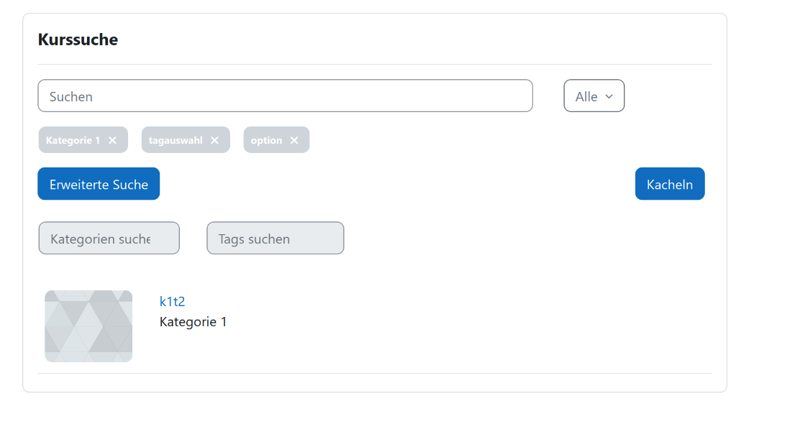

# Benutzeranleitung

**Kurs-Suche** ist ein Block, mit dem Sie Kurse nach den folgenden Kriterien durchsuchen können:

- Volltextsuche im Kursnamen und in der Kursbeschreibung  
- Kursbereich  
- Ob der Kurs bereits abgeschlossen, aktuell laufend oder für die Zukunft geplant ist  
- Benutzerdefinierte Kursfelder  
- Schlagwörter  

Sie können zwischen zwei Ergebnisformaten wählen: **Liste** und **Kacheln**.  

Die durchsuchbaren Auswahlfelder (**Dropdowns**) erlauben Mehrfachauswahl und beeinflussen sich gegenseitig.  
Das bedeutet: Wenn Sie in einem Feld etwas auswählen, zeigen die anderen Felder nur noch gültige Auswahloptionen an, die Ergebnisse liefern.

Das Plugin besteht aus zwei Hauptbereichen:  

- Suchbereich  
- Ergebnisbereich  

## Suchbereich

### Verwendung der durchsuchbaren Auswahlfelder

1. Klicken Sie auf ein Feld  
   - Es öffnet sich ein Dropdown mit einer festen Anzahl an Optionen.  
   - Benutzerdefinierte Auswahlfelder zeigen zusätzlich eine Beschreibung oben an, sofern eine vorhanden ist.

2. Um weitere Optionen zu sehen, geben Sie einen Suchbegriff in das Suchfeld ein. Die Optionsliste wird nach kurzer Zeit aktualisiert.  
   - Die Optionsliste ist in einen Bereich mit **Ausgewählte Elemente** und einen mit **Verfügbare Elemente** unterteilt.  
   - Um das Suchfeld zu leeren, klicken Sie auf das Symbol **„x“** auf der rechten Seite.

3. Wählen Sie ein Element durch Anklicken aus. Das Element erscheint im Bereich **Ausgewählte Elemente**.  
   - Um ein Element abzuwählen, klicken Sie erneut darauf.  
   - Der Ergebnisbereich des Plugins wird sofort aktualisiert.

Je nach Anzahl der verfügbaren Suchfelder kann es eine Schaltfläche **Suche erweitern** geben, um zusätzliche Felder einzublenden.  
  
Wenn vom Administrator aktiviert, gibt es eine Anzeige aller ausgewählten Filter. Diese können hier auch abgewählt werden.  

### Volltextsuche

Die Volltextsuche wendet den Suchbegriff auf den Kursnamen und die Kursbeschreibung an.  
Es kann eine Seite mit der Meldung **„Keine Ergebnisse“** angezeigt werden.

## Ergebnisbereich

Dieser Bereich enthält die Suchergebnisse entweder in Listenform oder in Kachelform, die die gefundenen Kurse anzeigen.  

Wenn es eine Kursbeschreibung gibt, können Sie diese in der Listenansicht erweitern.

Am unteren Rand befinden sich Schaltflächen zum Blättern durch die Ergebnisse, falls zu viele vorhanden sind, um auf einer Seite angezeigt zu werden.

