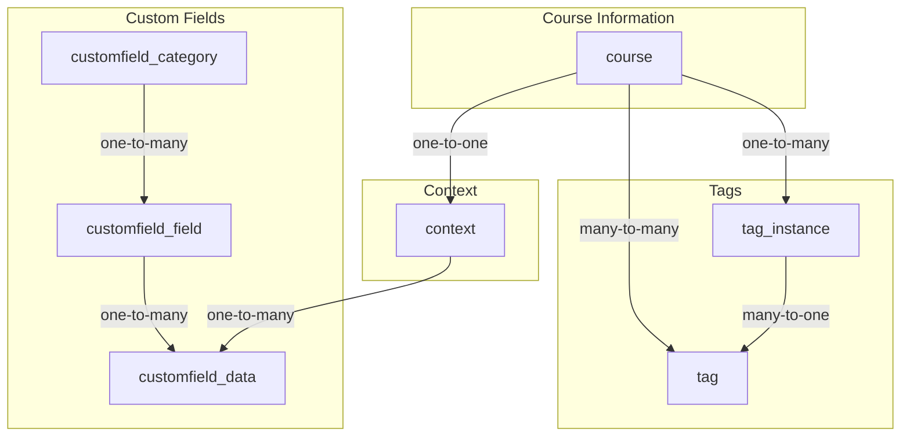

# Moodle Block: Coursesearch

## Backend classes and functions and their relations

This document describes the backend architecture of the Eledia Telc Coursesearch block.

### Entry Point: `block_eledia_telc_coursesearch.php`

The main entry point for the block is the `block_eledia_telc_coursesearch` class in `block_eledia_telc_coursesearch.php`. This class is responsible for:

*   **Initialization:** The `init()` method sets the block's title.
*   **Content Rendering:** The `get_content()` method is the core of the block's rendering logic. It performs the following steps:
    1.  Retrieves user preferences for grouping, sorting, and view mode using `get_user_preferences()`.
    2.  Instantiates the `\block_eledia_telc_coursesearch\output\main` class, passing the user preferences as arguments.
    3.  Gets the appropriate renderer for the block using `$this->page->get_renderer('block_eledia_telc_coursesearch')`.
    4.  Renders the output of the `main` class using the renderer's `render()` method.
    5.  Sets the rendered HTML as the block's content.

### Web Services: `classes/externallib.php`

The block exposes a set of web services through the `\block_eledia_telc_coursesearch\externallib` class. These services are defined in `db/services.php` and are used by the frontend to fetch data.

Here's a diagram illustrating the relationship between the main block class, the output class, and the external library:

```mermaid
graph TD
    A[block_eledia_telc_coursesearch] -- instantiates --> B[\block_eledia_telc_coursesearch\output\main];
    B -- renders --> C[HTML];
    D[Frontend JS] -- calls --> E[\block_eledia_telc_coursesearch\externallib];
    E -- returns --> F[JSON Data];
```

The following web services are available:

*   **`get_courseview`**: This is the primary endpoint for searching and filtering courses. It takes a set of criteria (custom fields, categories, tags, search term) and returns a list of matching courses.
*   **`get_available_categories`**: Returns a list of available course categories based on the current filter criteria.
*   **`get_available_tags`**: Returns a list of available tags based on the current filter criteria.
*   **`get_customfield_available_options`**: Returns a list of available options for a given custom field, based on the current filter criteria.
*   **`get_customfields`**: Returns a list of all visible custom fields that can be used for filtering.
*   **`get_enrolled_courses_by_timeline_classification`**: Retrieves a user's enrolled courses based on a classification (e.g., "in-progress", "past", "future").

### Database Queries

This section describes the main database queries used by the block.

#### `get_filtered_courseids()`

This is the most complex query in the block. It is responsible for finding all course IDs that match a given set of filter criteria. The query is built dynamically based on the provided filters.

Here's a breakdown of how the query is constructed:

1.  **Custom Fields:** For each selected custom field, a `LEFT JOIN` is added to the `customfield_data` table, and a `WHERE` clause is added to filter by the selected value.
2.  **Categories:** If any categories are selected, a `WHERE` clause is added to filter by the selected category IDs.
3.  **Tags:** If any tags are selected, a `LEFT JOIN` is added to the `tag_instance` table, and a `WHERE` clause is added to filter by the selected tag IDs.
4.  **Search Term:** If a search term is provided, a `WHERE` clause is added to search for the term in the course's full name, short name, and summary.
5.  **Progress:** If a progress filter is selected, a `WHERE` clause is added to filter by the course's start and end dates.

Here's a diagram illustrating the table relations in the `get_filtered_courseids()` query:



## Frontend JavaScript Code and API Endpoints

This section describes the frontend JavaScript code and its interaction with the backend API.

### Entry Point: `amd/src/main.js`

The main entry point for the block's JavaScript is the `init()` function in `amd/src/main.js`. This function initializes the two main frontend modules:

*   **`ViewNav`**: Handles the navigation elements (sorting, filtering, etc.).
*   **`View`**: Manages the display of the course list.

### Course View: `amd/src/view.js`

The `View` module is responsible for fetching and rendering the course list. It uses a `PagedContentFactory` to handle pagination.

#### Key Functions:

*   **`init(root)`**: Initializes the course view, sets up event listeners, and triggers the initial loading of courses.
*   **`initializePagedContent(root, promiseFunction, inputValue, params)`**: Creates a `PagedContentFactory` instance to handle pagination. It takes a `promiseFunction` that is responsible for fetching the course data.
*   **`getMyCourses(filters, limit, searchParams)`**: Fetches the list of courses from the backend using the `block_eledia_telc_coursesearch_get_courseview` web service.
*   **`renderCourses(root, coursesData)`**: Renders the course list using Mustache templates.

### Course Navigation: `amd/src/view_nav.js`

The `ViewNav` module handles the user's interactions with the navigation elements (e.g., changing the sort order, filtering by category).

#### Key Functions:

*   **`init(root)`**: Initializes the navigation elements and sets up event listeners.
*   **`registerSelector(root)`**: Sets up event listeners for the filter and display options. When a user changes a filter, it updates the user's preferences and reloads the course list.

### API Calls: `amd/src/repository.js`

The `repository.js` module is responsible for making all API calls to the backend. It uses the `core/ajax` module to send requests to the Moodle web services.

#### Key Functions:

*   **`getEnrolledCoursesByTimeline(args)`**: Calls the `block_eledia_telc_coursesearch_get_courseview` web service.
*   **`getCategories(args)`**: Calls the `block_eledia_telc_coursesearch_get_available_categories` web service.
*   **`getTags(args)`**: Calls the `block_eledia_telc_coursesearch_get_available_tags` web service.
*   **`getCustomfields(args)`**: Calls the `block_eledia_telc_coursesearch_get_customfield_available_options` web service.

### Data Structures

This section describes the main data structures that are transferred between the frontend and backend.

#### Course View Request (`get_courseview`)

This is the data structure that is sent from the frontend to the backend when requesting a list of courses.

```json
{
    "criteria": [
        {
            "key": "categoryName",
            "value": ""
        },
        {
            "key": "tagsName",
            "value": ""
        },
        {
            "key": "name",
            "value": ""
        },
        {
            "key": "selectedCategories",
            "categories": []
        },
        {
            "key": "limit",
            "value": 24
        },
        {
            "key": "offset",
            "value": 0
        },
        {
            "key": "progress",
            "value": "all"
        },
        {
            "key": "currentCustomField",
            "value": 0
        },
        {
            "key": "selectedCustomfields",
            "customfields": []
        },
        {
            "key": "selectedTags",
            "tags": []
        }
    ],
    "addsubcategories": true
}
```

#### Course View Response (`get_courseview`)

This is the data structure that is returned from the backend to the frontend.

```json
{
    "courses": [
        {
            "id": 1,
            "fullname": "My Course",
            "shortname": "course1",
            "summary": "<p>This is the summary of my course.</p>",
            "summaryformat": 1,
            "startdate": 1672531200,
            "enddate": 1675209600,
            "visible": true,
            "isfavourite": false,
            "showcoursecategory": true
        }
    ],
    "nextoffset": 24
}
```

## Stale Functions and Methods

This section lists functions and methods that are likely stale and no longer used.

### Backend

*   **File:** `classes/externallib.php`
    *   **Class:** `externallib`
        *   **Method:** `get_data()`
        *   **Method:** `get_enrolled_courses_by_timeline_classification()`
        *   **Method:** `get_enrolled_courses_by_timeline_classification_raw()`

### Frontend

*   **File:** `amd/src/repository.js`
    *   **Function:** `setFavouriteCourses()`
